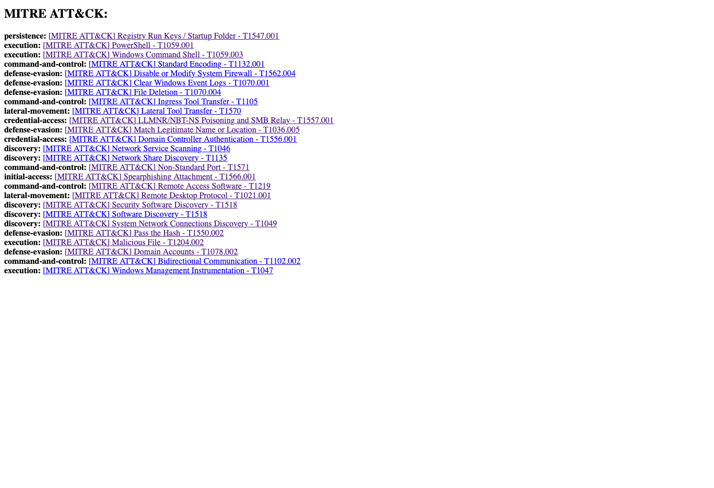

# MITRE ATT&CK  Navigator JSON file to HTML links

This is a simple script that takes the result of the ATT&CK navigator mappings in the form of a JSON file and outputs each technique in an HTML body format. The result can be used to easily share the links with teams or copy and paste on your projects/incidents etc. It has saved me some time so it can save you some time too especially if you have to do this a lot on a daily basis.

## Example output

 

